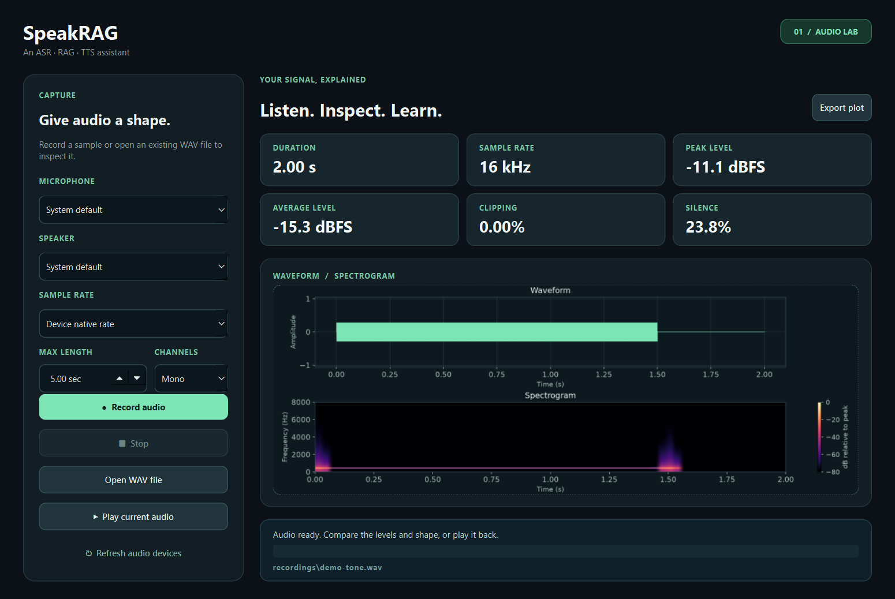

# SpeakRAG

SpeakRAG is a reusable ASR–RAG–TTS assistant project. The first milestone is a
local audio loop: record microphone audio, inspect the WAV file, and play it
back. Speech recognition, retrieval, and speech synthesis will be added in
later milestones. The first application will be a simulated vehicle assistant.



## Set up on Windows

Use Python 3.11 and a working microphone and speaker:

```powershell
py -3.11 -m venv .venv
.\.venv\Scripts\python.exe -m pip install -r requirements.txt
```

## Use the desktop interface

```powershell
.\.venv\Scripts\python.exe desktop_app.py
```

Choose a microphone, speaker, and recording length, then select **Record
audio**. The window shows the waveform, spectrogram, and six key measurements
when analysis finishes. **Stop** ends recording or playback after the current
audio chunk. **Open WAV file** lets you inspect a recording without using the
microphone. **Export plot** saves a copy of the current chart.

The interface uses PySide6 (Qt for Python). Recording, playback, and plotting
run in a background thread so the window remains responsive. The desktop app
and the command line use the same functions in `voice_loop.py`.

For learning: `SpeakRAGWindow` builds the controls and displays results;
`AudioJob` runs a requested operation on a `QThread`. The job sends progress,
result, or error signals back to the window. All microphone, WAV, and librosa
work stays in `voice_loop.py`, so the interface does not duplicate audio logic.

## Run the audio loop

```powershell
.\.venv\Scripts\python.exe voice_loop.py devices
.\.venv\Scripts\python.exe voice_loop.py loop --seconds 5 --plot plots\voice.png
```

The loop records a mono, 16-bit PCM WAV file at the microphone's native sample
rate (often 44.1 or 48 kHz) at
`recordings/voice.wav`, prints an analysis report, saves the optional plot, and
plays the recording. If Windows chooses the wrong audio device, use the numeric
IDs shown by `devices` with `--input-device` and `--output-device`. You can
request a specific rate with `--sample-rate 16000` if the device supports it.

The commands can also be run separately:

```powershell
.\.venv\Scripts\python.exe voice_loop.py record --seconds 5 --output recordings\sample.wav
.\.venv\Scripts\python.exe voice_loop.py analyse recordings\sample.wav --plot plots\sample.png
.\.venv\Scripts\python.exe voice_loop.py play recordings\sample.wav
```

The report includes the original sample rate, channel count, bit depth,
duration, peak and RMS levels, crest factor, DC offset, the percentage of
samples near clipping, and the percentage of frames below −40 dBFS. The plot
shows a waveform and spectrogram. Silence and clipping thresholds are simple
diagnostics; they do not measure speech quality by themselves.

The `recordings/` and `plots/` contents are ignored by Git so personal voice
recordings are not published accidentally. Review any files before adding them
to a public repository.

If `record` reports a PortAudio host or invalid-device error, first check
Windows **Settings → Privacy & security → Microphone**, confirm microphone
access for desktop apps, and try an explicit device ID from `devices`. Also
check that the microphone works in another local recording app. Device IDs can
change when headsets or other audio hardware are connected.

## Check the analysis code

```powershell
.\.venv\Scripts\python.exe -m unittest discover -s tests -v
```

## Project status

- [x] Local microphone capture and speaker playback with PyAudio
- [x] WAV inspection and plots with librosa
- [x] Desktop interface for the audio lab
- [ ] Automatic speech recognition (ASR)
- [ ] Retrieval-augmented generation (RAG)
- [ ] Text-to-speech (TTS)
- [ ] Vehicle application and evaluation
