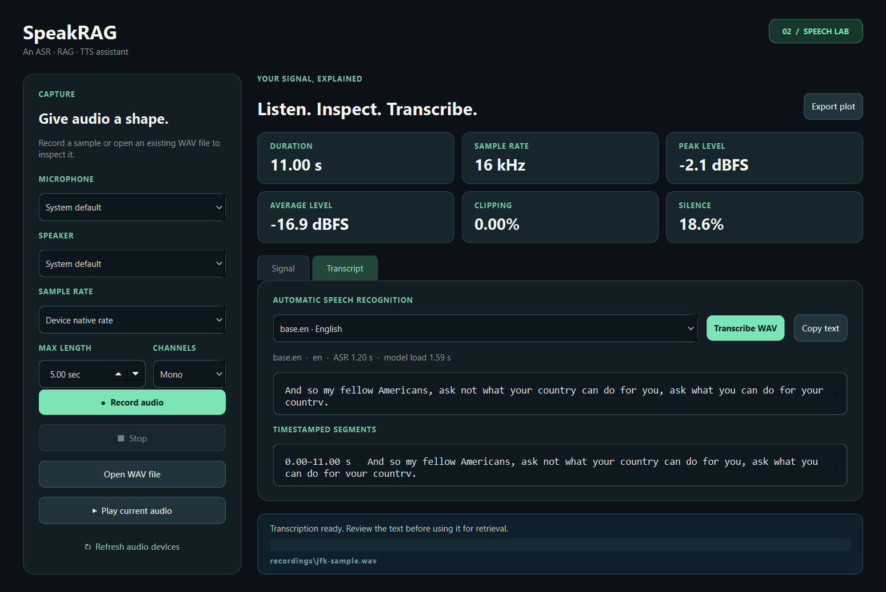

# SpeakRAG

SpeakRAG is a reusable ASR–RAG–TTS assistant project. It records, inspects,
plays, and transcribes WAV audio; retrieves handbook passages; generates a
grounded answer; and speaks that answer. The first application is a simulated
vehicle assistant.


The screenshots use the public [whisper.cpp JFK sample](https://github.com/ggml-org/whisper.cpp/tree/master/samples); the sample audio is not included in this repository.

## Set up on Windows

Use Python 3.11. A microphone and speaker are needed for recording and playback;
transcription also works with an existing WAV file.

```powershell
py -3.11 -m venv .venv
.\.venv\Scripts\python.exe -m pip install -r requirements.txt
```

## Use the desktop interface

After setup, double-click **Launch SpeakRAG.cmd** in the project folder. On
Windows, run `powershell -ExecutionPolicy Bypass -File .\make_shortcut.ps1` once
to create **SpeakRAG.lnk** in the same folder, with the project logo. The
shortcut points to this folder's virtual environment; run the script again if
you move the project or recreate `.venv`. The `.lnk` is local and Git-ignored.

The equivalent command is:

```powershell
.\.venv\Scripts\python.exe desktop_app.py
```

Choose a microphone, speaker, and recording length, then select **Record
audio**. The **Signal** tab shows the waveform, spectrogram, and six key
measurements. **Stop** ends recording or playback after the current audio
chunk. **Open WAV file** lets you inspect a recording without using the
microphone. **Export plot** saves a copy of the current chart.

In the **Transcript** tab, choose an ASR model and select **Transcribe WAV**.
The transcript is copyable and its timestamped segments appear underneath. The
default `base.en` model is for English; `base` detects among multiple languages.
The first use of each model downloads its weights into the Git-ignored
`models/` folder. Later runs use the local copy. Transcription runs on the CPU
with 8-bit computation, so an NVIDIA GPU is not required.



The interface uses PySide6 (Qt for Python). Recording, playback, and plotting
run in a background thread so the window remains responsive. The desktop app
and the command line use the same functions in `voice_loop.py`.

For learning: `SpeakRAGWindow` builds the controls and displays results;
`AudioJob` runs a requested operation on a `QThread`. The job sends progress,
result, or error signals back to the window. All microphone, WAV, and librosa
work stays in `voice_loop.py`, so the interface does not duplicate audio logic.
`asr.py` loads faster-whisper and consumes its segment generator to produce the
transcript. The window displays that result; it does not run the model itself.

## Build the automotive handbook RAG index

The sample source is the [official Hyundai India IONIQ 5 Owner's Manual](https://www.hyundai.com/content/dam/hyundai/in/en/data/connect-to-service/owners-manual/2025/ioniq5Oct2022-present.pdf).
The PDF used here has 568 pages and was downloaded on 27 September 2026.
Its SHA-256 starts `846a91864356a2b7`. It describes equipment for several
vehicle configurations and the India market; answers should not be treated as
instructions for a different vehicle or region.

In the **Handbook** tab, select **Prepare sample handbook**. The first run downloads
the PDF, downloads a small local embedding model, and builds the Qdrant index.
Then type a question or select **Use transcript** after ASR. **Search pages**
shows the retrieved text with PDF page numbers. **Generate answer** calls
OpenRouter's `qwen/qwen3.8-27b:free` model if configured; its answer should cite the
retrieved passages as `[1]`, `[2]`, and so on. Select **Speak answer** to hear it.

The same stages are available from PowerShell:

```powershell
.\.venv\Scripts\python.exe handbook_rag.py download
.\.venv\Scripts\python.exe handbook_rag.py index
.\.venv\Scripts\python.exe handbook_rag.py search "What should I do if charging stops abruptly?"
.\.venv\Scripts\python.exe handbook_rag.py status
```

You can replace the sample with another text-based PDF:

```powershell
.\.venv\Scripts\python.exe handbook_rag.py index --pdf "C:\path\to\manual.pdf" --title "My vehicle manual" --url "https://source.example/manual.pdf" --rebuild
```

`--rebuild` deliberately replaces this project's single handbook collection.
Close the desktop app before running CLI indexing or search: embedded Qdrant
allows only one process to open its storage at a time. It needs no Docker
service. A separate Qdrant server would be the next step for concurrent users.

For generated answers, put your OpenRouter key in the Git-ignored `.env` file:

```dotenv
openrouter=your_openrouter_api_key
```

`OPENROUTER_API_KEY` is also accepted. The `.env.example` file shows the format
without containing a real key. Then run:

```powershell
.\.venv\Scripts\python.exe handbook_rag.py ask "What should I do if charging stops abruptly?"
```

The selected free model has [OpenRouter rate limits](https://openrouter.ai/pricing/).
If generation reports HTTP 429, wait for the allowance to reset; **Search pages**
continues to work locally.

The PDF is extracted one page at a time. Each page is split into roughly
1,200-character chunks with 150-character overlap. FastEmbed's local
`all-MiniLM-L6-v2` model turns those chunks into 384-dimensional vectors;
Qdrant stores the vectors, text, source URL, and PDF page number. At query time,
SpeakRAG embeds the question, retrieves cosine-similar chunks, keeps distinct
pages, adds neighbouring text from each page, and applies a small keyword
rerank. The selected passages are sent to OpenRouter with instructions to answer
only from them and cite them. The request enables model reasoning; only the
final answer is displayed. Retrieved passages and your question leave your
computer only when you choose **Generate answer**.

The PDF, model weights, local Qdrant database, and `.env` are Git-ignored. The
public repository includes the source link and the code, but not Hyundai's
manual or copied text. PDF extraction can garble some styled headings, so
inspect the cited page when an answer matters.

## Speak the answer with Piper

The **Handbook** tab has a voice, speed, and speaker selector. After **Generate
answer**, select **Speak answer**. Piper turns the displayed answer into a local
WAV file at `recordings/answer.wav`; PyAudio plays that file through the chosen
speaker. **Stop** ends synthesis after its current chunk or stops playback.
The visible answer keeps its `[1]` citations, while `tts.py` removes citation
numbers from the spoken text. **Search pages** does not enable speech because it
only retrieves passages and does not generate an answer.

The first use of a voice downloads its ONNX model into the Git-ignored
`models/piper/` folder (about 63 MB for each of the included voices). The default
is the British English Alba voice. Later synthesis runs locally on the CPU and
does not send the answer to a TTS service. Piper uses ONNX Runtime for inference;
this is a small example of local model deployment, though it is not yet an
automotive edge deployment.

Try TTS without calling OpenRouter:

```powershell
.\.venv\Scripts\python.exe tts.py --list-voices
.\.venv\Scripts\python.exe tts.py "The charging instructions are on page 62 [1]." --play
.\.venv\Scripts\python.exe voice_loop.py analyse recordings\answer.wav
```

The first command lists the supported voices. The second synthesizes and plays
a short sample, and the third inspects the resulting WAV. Use
`--voice en_US-lessac-medium` to try the US English voice and `--rate 0.85` for
faster speech. A value above 1 makes speech slower. The [Piper Python
API](https://github.com/OHF-Voice/piper1-gpl/blob/main/docs/API_PYTHON.md)
provides `PiperVoice.load()` and `synthesize()`; `tts.py` writes its audio
chunks as PCM WAV and checks for **Stop** between chunks. `desktop_app.py` runs
this function in `AudioJob` so the window stays responsive, then hands the WAV
to the same `play_audio()` function used for microphone recordings. The voice
models come from [Piper Voices](https://huggingface.co/rhasspy/piper-voices).
Piper itself is GPL-3.0-or-later licensed; review that licence before distributing a
packaged copy of the application.

## Transcribe from the command line

To try ASR before recording works, download the public sample into the ignored
`recordings/` directory:

```powershell
Invoke-WebRequest -Uri 'https://raw.githubusercontent.com/ggml-org/whisper.cpp/master/samples/jfk.wav' -OutFile recordings\jfk-sample.wav
.\.venv\Scripts\python.exe asr.py recordings\jfk-sample.wav --model base.en
```

You can also open `recordings\jfk-sample.wav` in the desktop interface and
select **Transcribe WAV**. For your own audio, use:

```powershell
.\.venv\Scripts\python.exe asr.py recordings\sample.wav --model base.en
.\.venv\Scripts\python.exe asr.py recordings\sample.wav --model base.en --json
```

The first command prints the transcript and each segment's start and end time.
The second prints structured JSON for later evaluation or RAG integration.
The JSON and UI distinguish model loading from transcription time; the first
model load can include the one-time download.
ASR may mishear speech, so review the transcript before treating it as a search
query. Silent or non-speech audio may produce an empty or incorrect transcript.

## Run the audio loop

```powershell
.\.venv\Scripts\python.exe voice_loop.py devices
.\.venv\Scripts\python.exe voice_loop.py loop --seconds 5 --plot plots\voice.png
```

The loop records a mono, 16-bit PCM WAV file at the microphone's native sample
rate (often 44.1 or 48 kHz) at
`recordings/voice.wav`, prints an analysis report, saves the optional plot, and
plays the recording. If Windows chooses the wrong audio device, use the numeric
IDs shown by `devices` with `--input-device` and `--output-device`. You can
request a specific rate with `--sample-rate 16000` if the device supports it.

The commands can also be run separately:

```powershell
.\.venv\Scripts\python.exe voice_loop.py record --seconds 5 --output recordings\sample.wav
.\.venv\Scripts\python.exe voice_loop.py analyse recordings\sample.wav --plot plots\sample.png
.\.venv\Scripts\python.exe voice_loop.py play recordings\sample.wav
```

The report includes the original sample rate, channel count, bit depth,
duration, peak and RMS levels, crest factor, DC offset, the percentage of
samples near clipping, and the percentage of frames below −40 dBFS. The plot
shows a waveform and spectrogram. Silence and clipping thresholds are simple
diagnostics; they do not measure speech quality by themselves.

The `recordings/` and `plots/` contents are ignored by Git so personal voice
recordings are not published accidentally. Review any files before adding them
to a public repository.

If `record` reports a PortAudio host or invalid-device error, first check
Windows **Settings → Privacy & security → Microphone**, confirm microphone
access for desktop apps, and try an explicit device ID from `devices`. Also
check that the microphone works in another local recording app. Device IDs can
change when headsets or other audio hardware are connected.

## Check the analysis code

```powershell
.\.venv\Scripts\python.exe -m unittest discover -s tests -v
```

## Project status

- [x] Local microphone capture and speaker playback with PyAudio
- [x] WAV inspection and plots with librosa
- [x] Desktop interface for the audio lab
- [x] Local automatic speech recognition (ASR) for WAV files
- [x] PDF indexing and local Qdrant retrieval with page references
- [x] Grounded RAG generation using the configured OpenRouter model
- [x] Local text-to-speech (TTS) with Piper and PyAudio playback
- [ ] Vehicle application and evaluation
