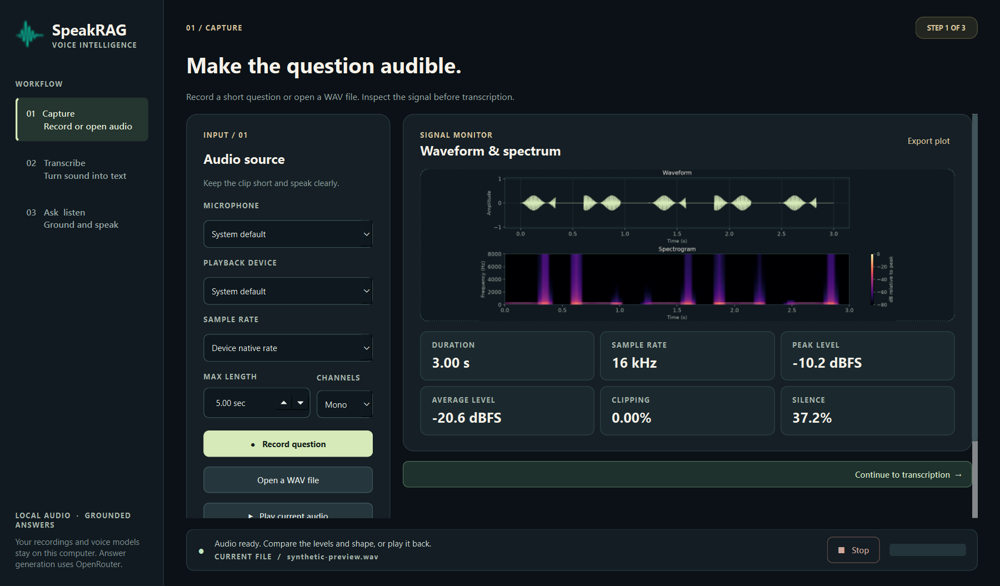
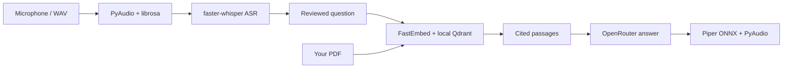
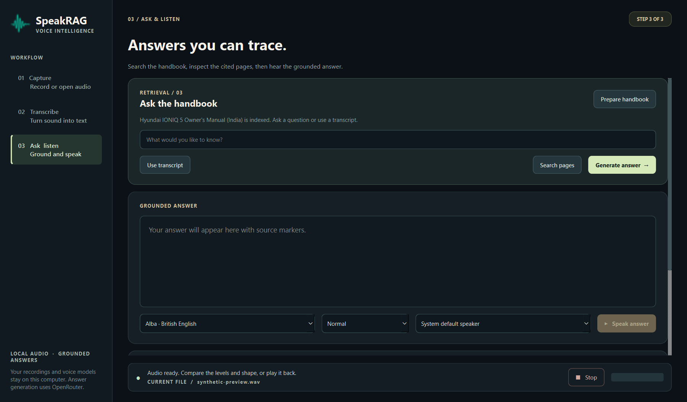

<div align="center">


# SpeakRAG

### Ask your documents with your voice.

A desktop learning project that connects speech recognition, cited retrieval,
LLM answers, and speech synthesis in one inspectable workflow.

[Explore the workflow](#the-workflow) · [Get started](#quick-start-on-windows) · [Read the architecture](docs/ARCHITECTURE.md)

</div>

SpeakRAG uses an automotive owner’s manual as its example, but you can index
another text-based PDF. Audio recognition, retrieval, and speech synthesis run
locally; answer generation sends the question and retrieved passages to
OpenRouter.



*The interface preview uses a synthetic audio signal. No personal recording or
handbook text is included in the screenshot.*

## The workflow

| Step | In the app | Main technology |
| --- | --- | --- |
| 1. Capture | Record or open a WAV; inspect waveform, spectrogram, levels, clipping, and silence | PyAudio, librosa |
| 2. Transcribe | Convert the WAV to text and review timestamped segments | faster-whisper, local CPU |
| 3. Ask & listen | Retrieve cited manual passages, generate an answer, and speak it | Qdrant, FastEmbed, OpenRouter, Piper ONNX |

The user starts each step explicitly. You can review the transcript before
selecting **Use transcript as question**. Retrieval and speech synthesis also
work independently from the command line.



The [architecture notes](docs/ARCHITECTURE.md) explain each module, where data
is stored, and which step makes a network request.

## Quick start on Windows

You need **Windows, Python 3.11, an audio output device, and an internet
connection for the initial model downloads**. A microphone is optional if you
start with an existing WAV file. Install the dependencies in a virtual
environment:

```powershell
py -3.11 -m venv .venv
.\.venv\Scripts\python.exe -m pip install -r requirements.txt
```

For generated answers, copy the example configuration and enter your own
OpenRouter key in the Git-ignored `.env` file:

```powershell
Copy-Item .env.example .env
```

```dotenv
openrouter=your_openrouter_api_key
```

Double-click **Launch SpeakRAG.cmd**, or run:

```powershell
.\.venv\Scripts\python.exe desktop_app.py
```

`make_shortcut.ps1` creates a local `SpeakRAG.lnk` with the project icon. Run it
again if you move the folder or recreate `.venv`:

```powershell
powershell -ExecutionPolicy Bypass -File .\make_shortcut.ps1
```

### First walkthrough

1. **Capture:** select a microphone and record a short question, or choose
   **Open a WAV file**. The signal monitor shows levels and a spectrogram.
2. **Transcribe:** choose an ASR model and select **Transcribe WAV**. Review the
   text before using it as a question. The first model load downloads its weights
   into `models/`.
3. **Ask & listen:** select **Prepare handbook** once, then use the transcript
   or type a question. **Search pages** shows local retrieval results;
   **Generate answer** sends the selected passages and question to OpenRouter.
   Inspect the cited PDF pages, then select **Speak answer**. Piper writes
   `recordings/answer.wav` and PyAudio plays it through the chosen speaker.

The first use of a Piper voice downloads its ONNX model into `models/piper/`.
The default is the British English Alba voice. Later TTS runs locally on the CPU.
The **Stop** control in the bottom bar interrupts recording, playback, or speech
synthesis between audio chunks.

If a microphone is unavailable, you can still explore the workflow with a WAV
file. Download the public [whisper.cpp sample](https://github.com/ggml-org/whisper.cpp/tree/master/samples)
and open it in the app:

```powershell
Invoke-WebRequest -Uri 'https://raw.githubusercontent.com/ggml-org/whisper.cpp/master/samples/jfk.wav' -OutFile recordings\jfk-sample.wav
```

## Automotive handbook example

The sample document is the [official Hyundai India IONIQ 5 Owner’s Manual](https://www.hyundai.com/content/dam/hyundai/in/en/data/connect-to-service/owners-manual/2025/ioniq5Oct2022-present.pdf).
SpeakRAG downloads it locally, extracts text page by page, splits each page into
overlapping chunks, embeds the chunks with `all-MiniLM-L6-v2`, and stores vectors
and page metadata in embedded Qdrant. Retrieved passages are shown with PDF page
numbers. **Generate answer** uses the configured OpenRouter
`qwen/qwen3.8-27b:free` model and asks it to cite those passages as `[1]`, `[2]`,
and so on. The free model may return HTTP 429 when its allowance is exhausted;
local **Search pages** still works.

The example manual covers the India market and multiple vehicle configurations.
Check the cited page and the correct manual for your vehicle before acting on an
answer. The manual itself is not committed to this repository.

To index a different text-based PDF from PowerShell:

```powershell
.\.venv\Scripts\python.exe handbook_rag.py index --pdf "C:\path\to\manual.pdf" --title "My manual" --url "https://source.example/manual.pdf" --rebuild
```

`--rebuild` replaces this project’s single local handbook collection. Close the
desktop app before using the RAG command line: embedded Qdrant supports one
process accessing its storage at a time.



## Command-line exercises

```powershell
.\.venv\Scripts\python.exe voice_loop.py devices
.\.venv\Scripts\python.exe voice_loop.py analyse recordings\sample.wav --plot plots\sample.png
.\.venv\Scripts\python.exe asr.py recordings\sample.wav --model base.en
.\.venv\Scripts\python.exe handbook_rag.py search "How do I charge the vehicle?"
.\.venv\Scripts\python.exe handbook_rag.py ask "How do I charge the vehicle?"
.\.venv\Scripts\python.exe tts.py "The answer is on page 62 [1]." --play
```

The last command runs TTS without calling OpenRouter. `tts.py --list-voices`
shows the available voice choices. The CLI also accepts `--voice` and `--rate`;
`0.85` is faster, while values above `1` are slower.

## Privacy and local data

`.gitignore` excludes `.env`, the handbook PDF, Qdrant data, downloaded models,
recordings, plots, caches, and the local shortcut. The committed screenshots use
synthetic or empty UI states. **Generate answer** sends your question and
retrieved passages to OpenRouter; capture, ASR, search, and TTS run locally after
their models are downloaded. Review `git status` before every public push.

## Development and scope

Run the project’s checks with:

```powershell
.\.venv\Scripts\python.exe -m unittest discover -s tests -v
git status --short
```

The app is a local learning prototype. It has no FastAPI/Kafka service, automated
evaluation suite, vehicle integration, or automotive safety validation. Piper is
distributed under GPL-3.0-or-later; review its licence before packaging and
redistributing the application.
