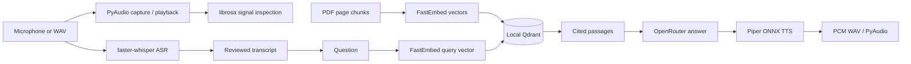

# Architecture and learning notes

SpeakRAG separates the user interface from each pipeline stage so you can run
and inspect each part on its own.

## Follow the code

| File | What to read for |
| --- | --- |
| `voice_loop.py` | PyAudio devices, PCM recording and playback, librosa measurements, and the waveform/spectrogram plot |
| `asr.py` | faster-whisper model loading, transcription segments, and timings |
| `handbook_rag.py` | PDF extraction, chunk overlap, FastEmbed vectors, Qdrant search, prompt construction, and OpenRouter request |
| `tts.py` | Piper model download and loading, citation cleanup, PCM WAV writing, and rate control |
| `desktop_app.py` | `AudioJob` background work, signals, workflow state, and result/error handling |
| `ui_layout.py` | Three-step navigation, widgets, and visual styling |

### Capture and signal inspection

`record_audio()` writes an uncompressed 16-bit PCM WAV. `play_audio()` reads
that WAV in small PyAudio chunks, which is why **Stop** can interrupt playback.
`analyse_audio()` asks librosa to preserve the file’s original sample rate. It
reports duration, bit depth, peak and RMS levels, the percentage of samples
near full-scale clipping, and the percentage of frames below a simple silence
threshold. These measurements help diagnose audio input; they are not a speech
quality score.

### Recognition

`transcribe_audio()` in `asr.py` loads faster-whisper and consumes its segment
generator to return text with timestamps. The `base.en` UI choice expects English;
`base` supports multilingual detection. The first run downloads model weights.
ASR can mishear words, so the UI asks you to review the transcript before it
becomes a retrieval question.

### Retrieval and answer generation

`handbook_rag.py` extracts the PDF one page at a time, then makes roughly
1,200-character chunks with 150-character overlap. The local
`all-MiniLM-L6-v2` embedding model produces 384-dimensional vectors. Qdrant
stores each vector with text, source URL, and PDF page number. Search embeds the
question, retrieves cosine-similar candidates, keeps distinct pages, adds
neighbouring text from the same page, and applies a small keyword rerank.

Only **Generate answer** sends the question and selected passages to OpenRouter.
The prompt tells the model to answer from those passages and cite `[1]`, `[2]`,
and so on. The app displays the final answer and the original source passages.
Generated citations are model output; check the cited page for important claims.

### Speech synthesis

`tts.py` uses a Piper voice model through ONNX Runtime. `spoken_text()` removes
the numeric citation markers from the speech while keeping them visible in the
answer. `synthesize_speech()` converts the remaining text into PCM WAV chunks.
The desktop worker then calls the same `play_audio()` function used for recorded
audio. The default voice is downloaded once; later synthesis does not need an
online TTS service. This demonstrates local model inference, not deployment on
vehicle hardware.

### Desktop threading

`SpeakRAGWindow` owns the controls and their current state. `AudioJob` runs
recording, plotting, ASR, retrieval, or TTS on a `QThread`. Its progress, stage,
result, and error signals return to the window on the GUI thread. This keeps
the interface responsive during downloads and inference. The three pages show
the deliberate sequence: capture, review transcript, ask and listen.

## Local and network data

- Local: recorded WAV files, downloaded ASR/TTS/embedding models, the handbook
  PDF, Qdrant vectors, and waveform plots.
- Network on first setup: dependency installation and model/manual downloads.
- Network on **Generate answer**: the question and selected handbook passages
  are sent to OpenRouter. The API key is read from the ignored `.env` file.

The `.env`, `handbooks/`, `models/`, `data/`, `recordings/`, and `plots/`
directories are ignored by Git. The public screenshots use a synthetic signal
or an empty page. The sample PDF and your personal recordings stay local.

## Current scope

This is a working desktop prototype with manual control over each stage. It
does not yet stream live microphone audio into ASR, expose a FastAPI endpoint,
publish Kafka events, evaluate faithfulness or WER continuously, or run inside
a vehicle. Those are separate engineering milestones.
